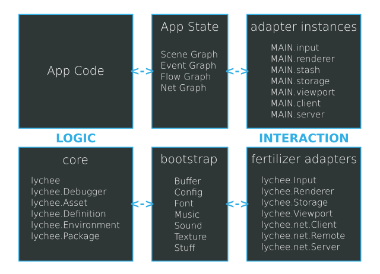

# MAIN Architecture

The `app.Main` instance of each project
offers a convenient way to integrate
Platform Adapters with zero lines of
platform-specific code.

Remember: The main goal of each Project
is to eliminate platform-specific code
as far as possible. Move platform-specific
code into Libraries to have reusable
Definitions that can be reused among
multiple Projects.




## App States

Each `lychee.app.State` and `lychee.ui.State` instance has
its own Scene Graph, that means all visible and non-visible
Layers and Entities are structured within `App States`.

The Serialization concept in lychee.js has a more effective
representation of the Scene Graph by offering a `deserialize(blob)`
API for each App State.

This `deserialize()` method is called by default with the
`attachments["json"]` of each App State.

That means that the `/source/state/Welcome.json` represents all
Layers and Entities that are initially contained in the
`/source/state/Welcome.js` and directly after the
`MAIN.setState('welcome')` call.

Every App State has an `enter(oncomplete)` and `leave(oncomplete)`
method that is called when the MAIN changes its App State.

By default these enter/leave methods will bind/unbind every event
listeners that are relevant for User Interaction, meaning that
only active App States can be interacted with by the User.


## Adapter Instances

Both the MAIN and the `App States` can access all Adapter
Instances. Those Adapter Instances are the abstraction for
platform-specific APIs and have the identical API across all
platforms.

The Platform Adapters in a `lychee.app.Main` instance are
by default completely integrated. If you want to deactivate
an Adapter, you have to set its equivalent `settings` entry
to `null`.

So, for example, to deactivate the `lychee.Input` instance,
you will have to set `new app.Main({ input: null })` or
override the defaults in the `/source/app/Main.js` file.

These are the optional Platform Adapters:

- `(lychee.app.Jukebox) MAIN.jukebox` - a Sound and Music player for queued and parallel playbacks
- `(lychee.app.Loop) MAIN.loop` - an event-firing Loop that simulates, interpolates and predicts update and render flow
- `(lychee.net.Client) MAIN.client` - a peer-to-peer Client for Websockets, HTTP and TCP
- `(lychee.net.Server) MAIN.server` - a peer-to-peer Server for Websockets, HTTP and TCP

These are the required Platform Adapters:

- `(lychee.Input) MAIN.input` - an event-firing Input for Keyboard, Mouse, Touch and Scroll API
- `(lychee.Renderer) MAIN.renderer` - a 2D buffer-capable Renderer
- `(lychee.Stash) MAIN.stash` - a network-synchronized Filesystem for the Asset API
- `(lychee.Storage) MAIN.storage` - a network-synchronized temporary and permanent Storage
- `(lychee.Viewport) MAIN.viewport` - an event-firing Viewport for Reshape and Orientation Changes

Remember, all Adapter Instances are also accessible in each
App State with the identical property name as in the MAIN.


## Example app.Main Definition

```javascript
lychee.define('app.Main').requires([
	'app.state.Welcome'
]).includes([
	'lychee.app.Main'
]).exports(function(lychee, global, attachments) {

	const _app  = lychee.import('app');
	const _Main = lychee.import('lychee.app.Main');


	/*
	 * IMPLEMENTATION
	 */

	let Composite = function(data) {

		let settings = Object.assign({
			input: {
				delay:       0,
				key:         true,
				keymodifier: false,
				scroll:      true,
				touch:       true,
				swipe:       true
			},
			jukebox: {
				music: true,
				sound: true
			},
			client: {
				host: 'example.com',
				port: 1337
			},
			server: null, // XXX: disabled lychee.net.Server
			renderer: {
				id:     'app',
				width:  null,
				height: null
			},
			viewport: {
				fullscreen: false
			}

		}, data);


		_Main.call(this, settings);


		/*
		 * INITIALIZATION
		 */

		this.bind('load', function(oncomplete) {
			oncomplete(true);
		}, this, true);

		this.bind('init', function() {

			this.setState('welcome', new _app.state.Welcome(this));

			this.changeState('welcome');

		}, this, true);

	};


	Composite.prototype = {

		/*
		 * ENTITY API
		 */

		// deserialize: function(blob) {},

		serialize: function() {

			let data = _Main.prototype.serialize.call(this);
			data['constructor'] = 'app.Main';


			let settings = data['arguments'][0] || {};
			let blob     = data['blob'] || {};

			// XXX: Add differences to lychee.app.Main here

			data['arguments'][0] = settings;
			data['blob']         = Object.keys(blob).length > 0 ? blob : null;


			return data;

		}

	};


	return Composite;

}); 
```

