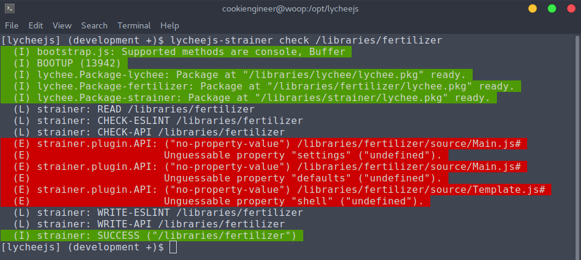

# lychee.js Strainer

The `lycheejs-strainer` is a Command-Line Wizard that helps
to lint, parse and understand Projects and Libraries and
their lychee.js Definitions.

It can be seen as a tool that automatically guesses how
your code works and that builds up a knowledge graph,
which in return is used by the Artificial Intelligence.

The workflow and how it is used is explained in the
[Workflow](../quickstart/Workflow.md) chapter.

The lychee.js Strainer uses `eslint` to parse the definition
files, so you have to install `eslint` globally before and
link it locally into your `/opt/lycheejs` installation.

```bash
# Preparations
sudo npm install -g eslint;
cd /opt/lycheejs;
npm link eslint;
```


## Checking a Project

The lychee.js Strainer can be started in the Terminal (bash)
via the `lycheejs-strainer` command.

The `check` action will lint, parse and try to understand the
Project's or Library's definition files. It will intelligently
only try to understand definitions in the lychee.js Definition
format. All other file formats are ignored.

```bash
cd /opt/lycheejs;

lycheejs-strainer; # show help


cd ./projects/my-project;

lycheejs-strainer check /projects/my-project; # check a project
```



The screenshot demonstrates typical errors that occur when
the Project or Library ignores the lychee.js
[CODESTYLE Guide](https://github.com/Artificial-Engineering/lycheejs/blob/development/guides/CODESTYLE.md).

In the above case a helper method with the name `setShell(shell)`
that uses a `typeof` check as suggested in the Codestyle would
fix the problem.

These hints are automatically parsed in the code, so that the
Composition aspect of definitions is freely combine-able and
hash-able by the knowledge graph.

As every Definition ships its own properties in the constructor,
composition can be done in an automated manner - also for fuzz
test generation.


## Staging a Project

If your Project or Library is ready and does not fire any
error messages, you can stage your Project to let the
Artificial Intelligence know that the Project is working
as intended.

This will help the Reinforcement Learning approach, so it's
recommended to stage often; whenever everything is stable
in the development process. Note that files that still fire
errors are ignored in the staging process to prevent
overfitting of false positives.

```bash
cd /opt/lycheejs;

cd ./projects/my-project;

lycheejs-strainer stage /projects/my-projects; # stage a project
```

