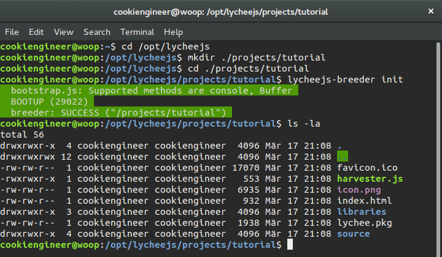

# Create a Server

This tutorial will explain how to create a Server that
uses the `node` platform stack with the `lychee.net.Server`
that can run server-side (or client-side).


## Prerequisites

You should have installed the lychee.js Engine already.


## Initialize the Project

The `/opt/lycheejs/projects` directory contains all projects
made with lychee.js. It already contains many examples and
demos that you can open, edit and manipulate with the
lychee.js Tools.

First of all, we need to create our new project using the
`lycheejs-breeder` command line tool.

It is explicitely important to create lychee.js Projects
only in the `/opt/lycheejs/projects` subfolder in order to
have all features offered by the lychee.js Engine.

As all tools are cross-dependent, the lychee.js Breeder also
interacts with the Fertilizer, Strainer, Harvester, Editor,
Ranger and all the other tools behind the scenes automagically.

```bash
cd /opt/lycheejs;

# Create the Project Folder
mkdir ./projects/tutorial;
cd ./projects/tutorial;

# Initialize the Boilerplate
lycheejs-breeder init;
```

The output of the above commands should look like this:




## Filesystem Structure

As the lychee.js Engine has the `/libraries` and `/projects`
folders by convention, all projects have also can have an
(optional) `/libraries` folder where they can snapshot their
libraries.

This makes it possible to publish an isolated lychee.js
Project to other servers that have no lychee.js Engine (or
Harvester) installed.

Here is how our Filesystem Structure looks like:

```
/projects/tutorial
+-- /libraries         - isolated libraries
| +-- /lychee
|   +-- /build         - isolated builds
|     +-- /node
|       +-- dist
|       | +-- index.js
|       +-- core.js
|
+-- /api               - auto-generated API data and docs
+-- /asset             - raw assets for build pipeline
+-- /build             - auto-generated builds
+-- /source            - source files
| +-- /net             - app.net namespace
|   +-- Server.js      - App Server
|   +-- /remote        - app.net.remote namespace
|   | +-- Ping.js      - Ping Service (remote)
|   +-- Client.js      - App Client
|   +-- /client        - app.net.client namespace
|   | +-- Ping.js      - Ping Service (client)
| +-- /state           - app.state namespace
|   | +-- Welcome.js   - Welcome state
|   | +-- Welcome.json - Welcome state attachment (scene graph)
| +-- Main.js          - App Main
+-- index.html         - source index (in-Browser Development Mode)
+-- harvester.js       - App Main (server-side)
+-- lychee.pkg         - Project Package
```


## Bootup the Project

As you might have noticed, the project automatically has
a `harvester.js` file. It is named that way, because it
is the integration entry point for the `lycheejs-harvester`.

The lychee.js Harvester automatically calls the `harvester.js`
and spawns the App Server on an ephermal port ( `49152` to `65534` )
dependent on what other programs already run on your machine
and use the ports already.

You have to start the `lycheejs-harvester` with the
`development` profile in a separate Terminal window.

```bash
cd /opt/lycheejs;

# Start lychee.js Harvester
lycheejs-harvester start development;
```

The output of the above command should look like this:

```bash
(I) harvester.mod.Server: BOOTUP ("/projects/tutorial | null:49157")
```


You can stop the lychee.js Harvester by pressing `[Ctrl] + [C]`
in the Terminal window.


## Definition Requirements

The Boilerplate already has an integrated `app.net.Server`
Definition which is easily extendable with further network
services.

The `HEADER` section of the `source/net/Server.js` file shows
that the server has both requirements and inclusions that the
Definition inherits from:

```javascript
lychee.define('app.net.Server').requires([
	'app.net.remote.Ping'
]).includes([
	'lychee.net.Server'
]) // ...
```

The Definition `app.net.Server` requires the `app.net.remote.Ping`
service that is a dummy service helping measure latencies in
our network.

Each Definition has an `exports()` call with the so-called `BODY`
section of a Definition file. This section contains and returns
the actual Implementation of your Definition.

The lychee.js [CODESTYLE Guide](https://github.com/Artificial-Engineering/lychee.js/blob/master/guides/CODESTYLE.md#definition-layout)
explains more in detail how the Definition Implementation is
structured.


## Clients and Remotes

Clients and Remotes both share the same `lychee.net.Tunnel`
interface, so they can be replaced in our peer-based network.

That means that depending on several network factors Clients
and Servers switch their role in a network to optimize the
data flow and reduce latency.

The `lychee.net.Tunnel` has an `addService()` method that accepts a
`lychee.net.Service` instance. In our case the `remote` currently
only has the `app.net.remote.Ping` service, but it will now be
extended with a custom network service.


## Create the Network Service

The `app.net.remote.Chat` service we are going to build will
inherit from the `lychee.net.remote.Chat` Composite, because
it is a very easy-to-use service.

The service will have the unique identifier `chat`, so that
we can easily identify it in the `Networks Tab` of our Dev Tools
in the Browser.

Create the `source/net/remote/Chat.js` file with the following
content:

```javascript
lychee.define('app.net.remote.Chat').includes([
	'lychee.net.remote.Chat'
]).exports(function(lychee, global, attachments) {

	var _Chat = lychee.import('lychee.net.remote.Chat');


	/*
	 * IMPLEMENTATION
	 */

	var Composite = function(remote) {

		_Chat.call(this, 'chat', remote, {
			limit: 1337 // allow 1337 users
		});

	};


	Composite.prototype = {
		
	};


	return Composite;

});
```


## Integrate the Network Service

Now that the `app.net.remote.Chat` service is ready
for use, it is possible to integrate it with the
`source/net/Server.js` Definition.

The following steps are required to do so:

1. Add the `app.net.remote.Chat` to the requirements.
2. Import the `app.net.remote.Chat` to `_Chat` variable.
3. Add `new _Chat(remote)` service in the `connect` event.


## Manage the Project

Every time you make a change to the `app.net.Server`
you can restart it in order to see the changes
immediately (and/or debug errors).

The lychee.js Engine stack is completely compatible
with the [node-inspector](https://github.com/node-inspector/node-inspector)
project.


Restart the Project Server with the `lycheejs-helper`:

```bash
cd /opt/lycheejs;

lycheejs-helper stop /projects/boilerplate;
lycheejs-helper start /projects/boilerplate;
```

The output of the above commands should look like this:

```bash
lycheejs-helper stop /projects/boilerplate;

{"message":"Server stopped (\"/projects/boilerplate\")","blob":null}

lycheejs-helper start /projects/boilerplate;

{"message":"Server started (\"/projects/boilerplate\")","blob":null}
```

