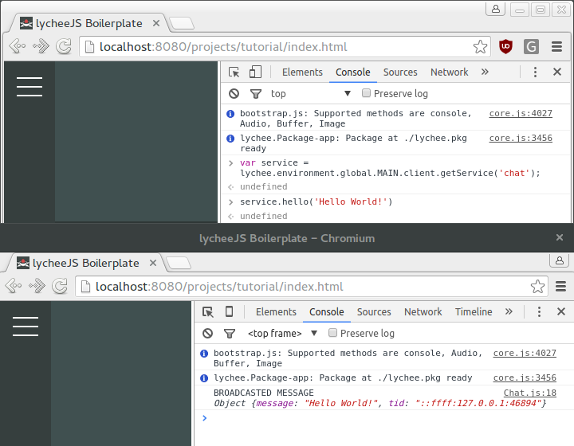

# Create a Client

This tutorial will explain how to create a Client that
uses the `html` platform stack with the `lychee.net.Client`
that can run client-side (or server-side).


## Prerequisites

- You should have completed the [Create a Server](./01-server.md)
  Tutorial.


## Create the Network Service

The `app.net.client.Chat` service we are going to build will
inherit from the `lychee.net.client.Chat` Composite, because
it is a very easy-to-use service.

The client-side service is the counterpart of the previously
created server-side service.

Create the `source/net/client/Chat.js` file with the following
content:

```javascript
lychee.define('app.net.client.Chat').includes([
	'lychee.net.client.Chat'
]).exports(function(lychee, global, attachments) {

	var _Chat = lychee.import('lychee.net.client.Chat');


	/*
	 * IMPLEMENTATION
	 */

	var Composite = function(client) {

		_Chat.call(this, 'chat', client, {
			room: 'hello-world',
			user: '@awesome'
		});

		this.bind('broadcast', function(data) {
			console.log('BROADCASTED MESSAGE', data);
		}, this);

	};


	Composite.prototype = {

		/*
		 * CUSTOM API
		 */

		hello: function(message) {

			message = typeof message === 'string' ? message : null;

			if (message !== null) {

				this.broadcast({
					message: message
				});

			}

		}

	};


	return Composite;

});
```


## Integrate the Network Service

Now that the `app.net.client.Chat` service is ready
for use, it is possible to integrate it with the
`source/net/Client.js` Definition.

The following steps are required to do so:

1. Add the `app.net.client.Chat` to the requirements.
2. Import the `app.net.client.Chat` to `_Chat` variable.
3. Add `new _Chat(client)` service in the `connect` event.

The important implementation detail is that the service
uses the `broadcast()` method in order to send the
message across the network.

Broadcasting makes sure every peer that is connected to
our server receives it, much better would be using
`multicast()` later with a session to be more
bulletproof.

In both cases the server acts as a so-called `Turtle Router`
if a connected client is hidden behind a Firewall or NAT.


## Debugging the Client

By default, the `index.html` of each project uses the
`lychee.pkginit()` method in order to use the package.

The `debug: true` flag can be activated in order to have
better debugging messages. If `sandbox: true` is set, the
`lychee.Environment` will not pollute the global scope
with Definitions or platform-specific methods.

If the `lycheejs-harvester` is not started already, start it.

Open up the Browser now and open up the URL `http://localhost:8080/projects/tutorial/index.html`
so that we can inspect our current Project.


## lychee.js Environments

The lychee.js Engine is built for multiple Environments
that can be running in parallel. Depending on an
Environment setup, those can interact or be used for
simulation purposes.

The active Environment is mapped on the `lychee.environment`
property. Open up the `Console Tab` of the Dev Tools and
enter the following code to send a message to all
other active peers (try more than one Browser in parallel):


```javascript
var service = lychee.environment.global.MAIN.client.getService('chat');

service.hello('Hello World!');
```

Now open up the `Network Tab` of the Dev Tools and inspect
the last (WebSocket) connection to see what has been sent.



