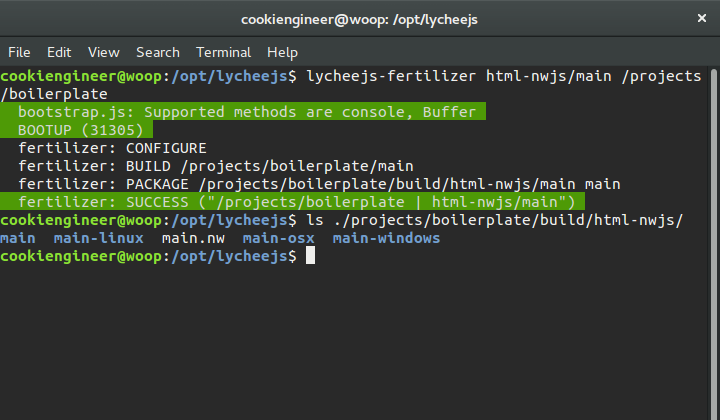

# Fertilize a Project

The lychee.js Engine comes with a Fertilizer concept that
allows a flexible way to build, package and distribute Apps.


## Prerequisites

- You should have initialized a lychee.js Project already.


## Build Targets

Every lychee.js Project and lychee.js Library has a `lychee.pkg`
file. This package file also contains several different
`build target` which are grouped by the `platform` tag.

A typical build targets of a Project is e.g. `html-nwjs/main`
or `node/main`, where the `node/main` build is probably the
server-side part of the App.

All build targets can be found inside the `lychee.pkg`
file in the `/build/environments` section, the structure will
look similar to this example:

```json
{
  "build": {
    "environments": {
      "html-nwjs/main": {
        "build": "app.Main",
        "debug": false,
        "packages": [
          [
            "app",
            "./lychee.pkg"
          ]
        ],
        "sandbox": false,
        "tags": {
          "platform": [
            "html-nwjs",
            "html"
          ]
        },
        "variant": "application",
        "profile": {
          "client": "/api/Server?identifier=/projects/boilerplate"
        }
      }
    }
  }
}
```


## Fertilizer Usage

The lychee.js Fertilizer is a CLI tool that allows to automate
the build, packaging and publishing process completely.

It supports an `auto` mode that will automatically build every
build target in a parallel multi-threaded way.

```bash
cd /opt/lycheejs;

# Fertilize all build targets
lycheejs-fertilizer auto /projects/boilerplate;

# Fertilize only html-nwjs/main (app.Main) build target
lycheejs-fertilizer html-nwjs/main /projects/boilerplate;
```

If everything works as expected, the output of a typical build
will look like this:



After you have fertilized your Project, you can directly run
the native build for your operating system. If you are on a
64 Bit GNU/Linux system, the location of the binary is
`./build/html-nwjs/main-linux/x86_64/main.bin`.

Here's what the direct comparison of the Boilerplate running
on the `html` platform (in the Web Browser) and running on
the native `nwjs` platform (in the Native Desktop binary)
looks like:


## The Fertilizer Procedure

The lychee.js Fertilizer supports four major steps in the build flow:

- `configure` for configurations, preparations and dependencies
- `build` for the compilation of the program code
- `package` for further bundling (e.g. creating a `deb` or `apk` file)
- `publish` for deployment into a cloud infrastructure or upload to a hosting service.

Each step is processed first with the lychee.js internal
Logic, then with the custom Project or Library logic.

Each step has an (optional) equivalent `bin/<step>.sh` file
that is executed in a `bash` shell.

Customization of the build flow is optional and all build
scripts in the project's `./bin/` folder will receive the
`build target` as their first argument.


## Customize the Fertilizer Procedure

The lychee.js Fertilizer uses a `bash` based customization
approach where you simply place your shell scripts at `./bin/<step>.sh`
to modify each step.

That allows flexible integration with third-party build
systems without having to write annoying wrappers for them
all the time.

An example included in this Tutorial is the [./bin/package.sh](./15-fertilizer/bin/package.sh)
which is borrowed from the Lethal Maze game and will show
you some examples on how you can package your App.

